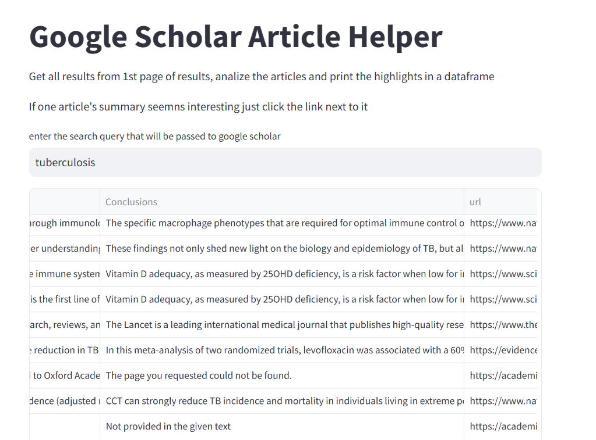

# Create an AI research helper using LLM /Scrape with LLM

The purpose is to create a program that scrapes the web just for scientific articles.\
I created a streamlit based application where the user enters the search keyword.\
This will then trigger the back-end to call Google Scholar with the keyword\

Playwriting is then instantiated in an async manner and accesses all the pages\
The content from the pages will be feed to an LLN which returns the data in a pydantic way\
All the data from all the pages is gathered in a dataframe which is presented to the user\
The uses thus sees the sumarry of each part of the article and can decide if he wants to visit the full article\
,the last column in the dataframe is the link so he can just access it there

 
### Implementation notes:

I used a pidantic class named ArticleInfo \
the return class has each section a scientific article would have 

*Title \
*Methods\
*Results\
*Conclusions

And this is the result of the LLM being feed the data provided by Playwright\
after it accesses the page in a real way (not headless) to bypass anti-scrapping defences.

After the search keyword is entered, Google Scholar is called using that keyword.\
All links in Google Scholar are scraped.
Then in an async way 4 pages are loaded in parallel using a Semaphore\
A Semaphore is used to limit the number of paralel page loads as this again can trigger anti scrapping software

### Results:

and we also have the link to the article at the end:

and we also have the link to the article at the end:

### Conclusions:

it takes around 20 s to get the dataframe ,
there are around 16 links to articles in the results of Google Scholar\
and we access these 3 at a time due to the Semaphore

After all their content is gathered the LLM is called in an async way but here directly without a semaphore to limit the async calls
